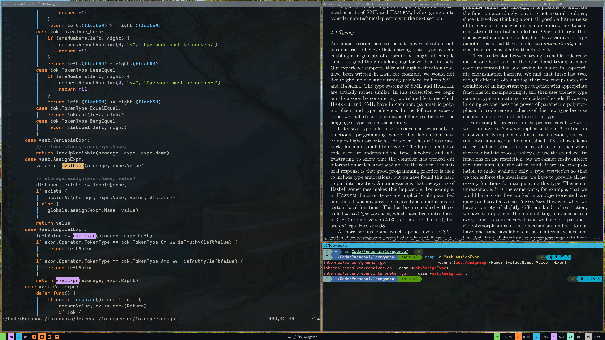

# .config

## Programs

|  Type            |  Program       |
|------------------|----------------|
|  Distro          |  Arch (btw)    |
|  Package manager |  yay           |
|  WM+DE           |  i3            |
|  Compositor      |  picom         |
|  Bar             |  polybar       |
|  Browser         |  firefox       |
|  Shell           |  fish          |
|  Terminal        |  kitty         |
|  IDE             |  nvim          |
|  Image viewer    |  feh           |
|  Video player    |  mpv           |
|  PDF viewer      |  zathura       |
|  PPT viewer      |  zaread        |

## Guide

The `.setup` file is meant for a quick start on a fresh Arch install.

I can not and will not guarantee that the setup will work for everyone,

as it is not meant for everyone.

It installs a lot more programs than I have listed in the programs section,

and I keep updating it to match my current daily driver.

**If you want to copy my setup**, I would suggest that you

**just copy the contents of the .config folder** for all the programs that you need.
